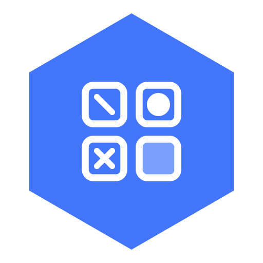
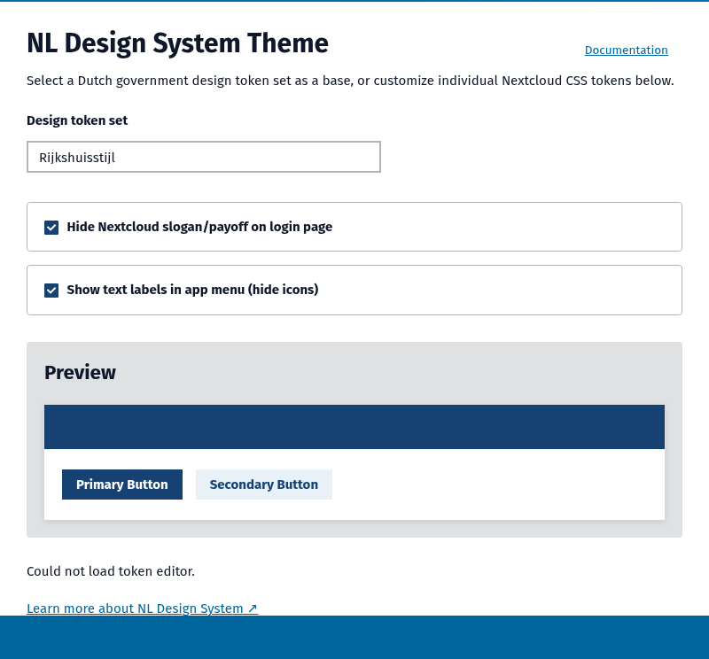
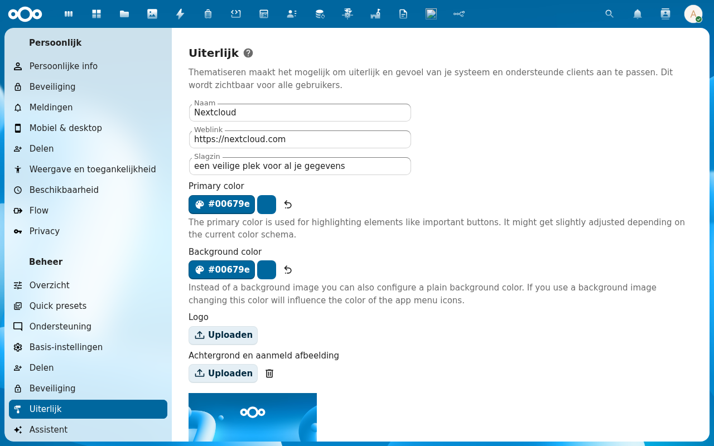
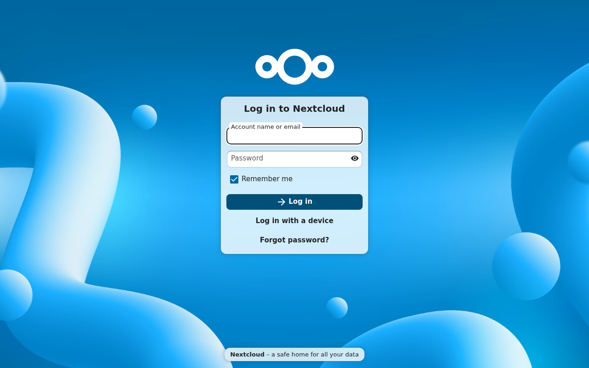
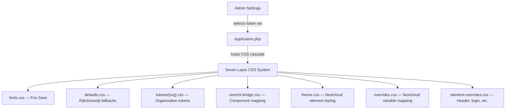

<p align="center">
  
</p>

<h1 align="center">NL Design System Theme</h1>

<p align="center">
  <strong>Dutch government design tokens for Nextcloud — 39 token sets, Rijkshuisstijl, and WCAG AA compliance</strong>
</p>

<p align="center">
  <a href="https://github.com/ConductionNL/nldesign/releases"></a>
  <a href="https://github.com/ConductionNL/nldesign/blob/main/LICENSE"></a>
  <a href="https://github.com/ConductionNL/nldesign/actions"></a>
  <a href="https://nldesign.app"></a>
</p>

---

NL Design System Theme transforms your Nextcloud into a fully branded Dutch government workspace. Select your organization's token set in admin settings and the entire interface updates instantly — colors, typography, header, login page, and all. No build step, no Vue frontend, just pure CSS theming powered by the official NL Design System tokens.

It works seamlessly with every Nextcloud app that follows standard theming conventions, and pairs naturally with [NL Design System](https://nldesignsystem.nl/) for government-compliant digital services.

## Screenshots

<table>
  <tr>
    <td></td>
    <td></td>
    <td></td>
  </tr>
  <tr>
    <td align="center"><em>Token Sets</em></td>
    <td align="center"><em>Admin Settings</em></td>
    <td align="center"><em>Themed Login</em></td>
  </tr>
</table>

## Features

### Token Sets
- **39 Organizations** — Rijkshuisstijl (national government), Amsterdam, Utrecht, Rotterdam, Den Haag, Groningen, Nijmegen, Tilburg, Leiden, Zwolle, and 29 more municipalities and organizations
- **20 Official Logos** — SVG logos sourced from official websites and the NL Design System themes repository
- **One-Click Theming** — Select a token set in admin settings and the entire Nextcloud interface adapts instantly
- **Theming Sync** — Automatically syncs Nextcloud's built-in theming (login page, email templates) to match your selected token set
- **Smart Fallbacks** — Incomplete token sets automatically inherit from Rijkshuisstijl defaults via `defaults.css`

### Compliance & Accessibility
- **WCAG AA** — All token sets designed for accessibility compliance with proper contrast ratios
- **Rijkshuisstijl** — Follows Dutch national government visual identity standards
- **Fira Sans Font** — Open-source alternative to proprietary government fonts, loaded via CDN
- **NL Design System** — Built on the official Dutch government design token standard

### Developer Features
- **Seven-Layer CSS Variable System** — Structured cascade from fonts through element overrides
- **No Build Required** — Pure CSS theming; fonts loaded via CDN, tokens are pre-compiled CSS files
- **Nightly Token Sync** — GitHub Actions workflow automatically syncs upstream NL Design System changes
- **Filesystem Discovery** — Adding new token sets requires only a CSS file and a JSON manifest entry; no PHP changes

## Architecture



### CSS Load Order

| Layer | File | Purpose |
|-------|------|---------|
| 1 | `fonts.css` | Loads Fira Sans from CDN |
| 2 | `defaults.css` | Sensible Rijkshuisstijl-based defaults for all `--nldesign-*` tokens |
| 3 | `tokens/{org}.css` | Organization-specific token overrides |
| 4 | `utrecht-bridge.css` | Maps `--utrecht-*` component tokens to `--nldesign-component-*` |
| 5 | `theme.css` | Maps `--nldesign-*` tokens to Nextcloud element styling |
| 6 | `overrides.css` | Maps Nextcloud CSS variables to `--nldesign-*` tokens |
| 7 | `element-overrides.css` | Applies NL Design styling to specific Nextcloud elements |

### Directory Structure

```
nldesign/
├── appinfo/           # Nextcloud app manifest, routes
├── lib/               # PHP backend — settings controller, token set service
├── css/
│   ├── fonts.css      # Fira Sans font declarations
│   ├── defaults.css   # Fallback values for all --nldesign-* tokens
│   ├── tokens/        # 39 organization token set CSS files
│   ├── utrecht-bridge.css
│   ├── theme.css
│   ├── overrides.css
│   └── element-overrides.css
├── img/
│   └── logos/         # 20 organization logos (SVG)
├── scripts/           # Token generation and logo scripts
├── token-sets.json    # Manifest of available token sets + theming metadata
├── docs/              # Architecture and token documentation
└── docusaurus/        # Product documentation site (nldesign.app)
```

## Requirements

| Dependency | Version |
|-----------|---------|
| Nextcloud | 28 -- 33 |
| PHP | 8.1+ |

No additional dependencies. This is a pure CSS theming app -- no OpenRegister, no Vue frontend, no npm build step required at runtime.

## Installation

### From the Nextcloud App Store

1. Go to **Apps** in your Nextcloud instance
2. Search for **NL Design System Theme**
3. Click **Download and enable**

### From Source

```bash
cd /var/www/html/custom_apps
git clone https://github.com/ConductionNL/nldesign.git
php occ app:enable nldesign
```

Then navigate to **Settings > Administration > Theming** and select your token set.

## Development

### Start the environment

```bash
docker compose -f openregister/docker-compose.yml up -d
```

### Working with tokens

No npm build is needed for the app itself. Token sets are pre-compiled CSS files. To regenerate tokens from the upstream NL Design System themes repository:

```bash
git clone https://github.com/nl-design-system/themes.git /tmp/themes
node scripts/generate-tokens.mjs /tmp/themes
```

### Adding a new token set

1. Create a CSS file in `css/tokens/` with `--nldesign-*` variables
2. Add an entry to `token-sets.json` with `id`, `name`, `description`, and `theming` metadata
3. Optionally add a logo SVG at `img/logos/{id}.svg`
4. No PHP changes needed -- the admin dropdown uses filesystem scanning

### Code quality

```bash
# PHP
composer phpcs          # Check coding standards
composer cs:fix         # Auto-fix issues
composer phpmd          # Mess detection
composer phpmetrics     # HTML metrics report

# CSS
npm run stylelint       # CSS linting
```

## Tech Stack

| Layer | Technology |
|-------|-----------|
| Theming | CSS custom properties (design tokens) |
| Token Source | NL Design System themes repository |
| Fonts | Fira Sans via fontsource CDN |
| Backend | PHP 8.1+, Nextcloud App Framework |
| Discovery | Filesystem-based token set scanning (no database) |
| Quality | PHPCS, PHPMD, phpmetrics, Stylelint |

## Documentation

Full documentation is available at **[nldesign.app](https://nldesign.app)**

| Page | Description |
|------|-------------|
| [Getting Started](https://nldesign.app/docs/intro) | Installation and first configuration |
| [NL Design System](https://nldesignsystem.nl/) | Official Dutch government design token standard |
| [NL Design Themes](https://github.com/nl-design-system/themes) | Upstream token source repository |

## Standards & Compliance

- **Design standard:** NL Design System (Dutch government design token specification)
- **Visual identity:** Rijkshuisstijl (Dutch national government brand guidelines)
- **Accessibility:** WCAG AA contrast and readability requirements
- **Font licensing:** Fira Sans under SIL Open Font License 1.1
- **Localization:** English and Dutch

## Related Apps

- **[OpenRegister](https://github.com/ConductionNL/openregister)** -- Object storage and data register
- **[OpenCatalogi](https://github.com/ConductionNL/opencatalogi)** -- Publication and catalog management
- **[MyDash](https://github.com/ConductionNL/mydash)** -- Dashboard app (supports NL Design theming)
- **[Procest](https://github.com/ConductionNL/procest)** -- Case management (supports NL Design theming)
- **[Pipelinq](https://github.com/ConductionNL/pipelinq)** -- CRM intake (supports NL Design theming)

## License

EUPL-1.2

## Authors

Built by [Conduction](https://conduction.nl) -- open-source software for Dutch government and public sector organizations.
