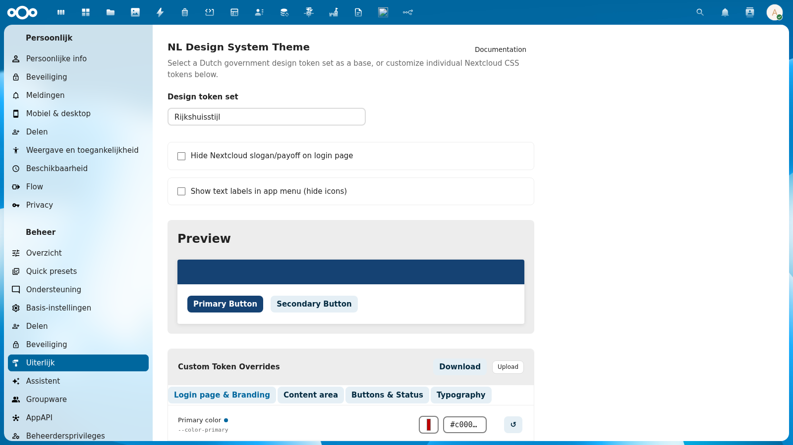
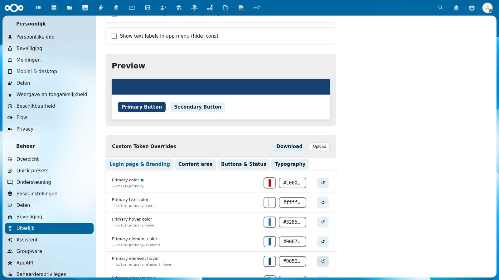

# Admin Settings

NL Design provides an admin settings panel for configuring the active theme, optional display settings, and per-token CSS overrides.

## Accessing Settings

1. Log in as a Nextcloud administrator
2. Go to **Administration Settings** (click your avatar, then "Administration settings")
3. Navigate to **Appearance** in the left sidebar
4. Scroll down to the **NL Design System Theme** section

## Token Set Selector

The main control is a dropdown listing all 39 available token sets. When you select a token set:

- The CSS theme updates immediately on the current page
- A color preview swatch shows the selected theme's primary color
- Nextcloud's theming system is synced with the new primary color, background, and logo (see [Theming Sync](theming-sync))

When you switch to a different token set, the [Apply Token Set dialog](apply-dialog) appears, letting you review and selectively apply the token changes to your custom overrides.

## Display Options

Below the token set selector, two toggle checkboxes provide optional adjustments:

### Hide Login Slogan

Controls whether the tagline/slogan text is visible on the Nextcloud login page. Enable this for a cleaner login experience that focuses on the organization's branding.

### Show Menu Labels

Controls whether text labels appear next to the icons in Nextcloud's left sidebar navigation. By default, Nextcloud shows only icons — enabling labels improves accessibility and usability, especially for new users.

## Preview Section

The **Preview** section shows a live preview of the current theme's primary color applied to sample buttons. This updates immediately as you switch token sets or modify individual tokens.

## Custom Token Overrides

The **Custom Token Overrides** section lets you fine-tune individual CSS tokens beyond what your selected token set provides. Changes apply instantly as a live preview.

See the dedicated pages for full details:

- [Token Editor](token-editor) — Edit individual CSS tokens across 4 category tabs
- [Import & Export](import-export) — Download your overrides as CSS or upload a CSS file
- [Apply Token Set Dialog](apply-dialog) — Review and selectively apply token set changes

## Technical Details

The admin settings panel is built with vanilla JavaScript and PHP templates (no Vue.js or webpack build step). This keeps the admin UI lightweight and avoids frontend build dependencies.

Settings are stored in Nextcloud's `IConfig` system and take effect immediately without requiring a page reload for the CSS changes.
