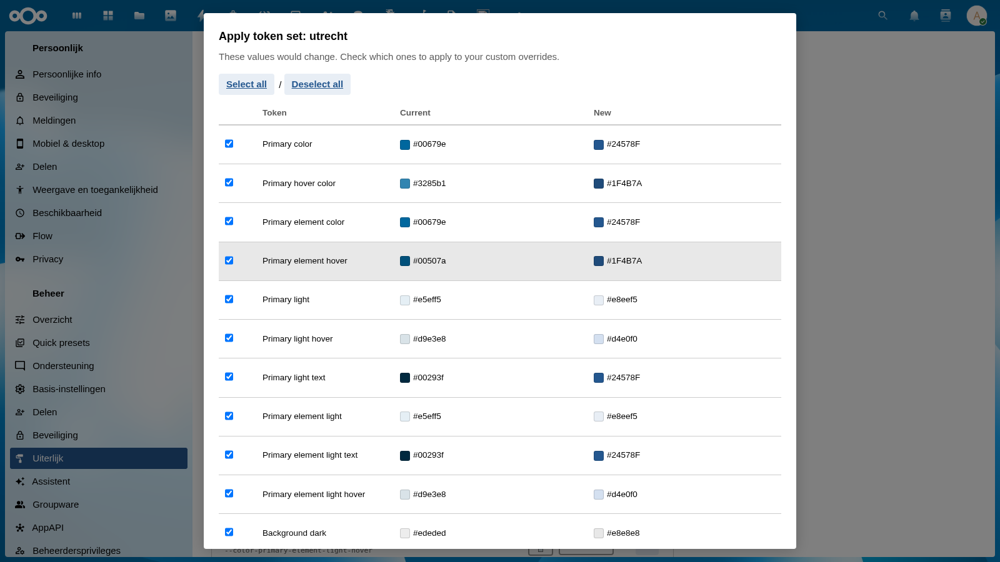
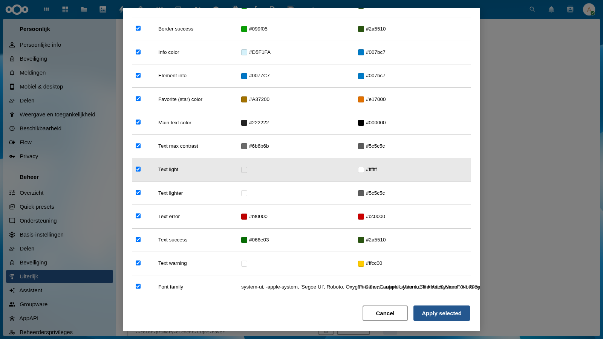

# Apply Token Set Dialog

When you switch to a different token set using the **Design token set** dropdown, the **Apply token set** dialog appears. This dialog lets you review exactly which tokens would change, and choose which ones to apply to your custom overrides.

## When It Appears

The dialog opens automatically whenever you select a different token set than the currently active one. It shows a comparison of all tokens that differ between your current overrides and the new token set's values.

If the new token set has no differences from your current overrides, the dialog does not appear.

## Dialog Overview

The dialog contains:

- **Title** — shows the name of the token set being applied (e.g., "Apply token set: utrecht")
- **Description** — brief explanation of what the dialog does
- **Select all / Deselect all** — bulk checkbox controls
- **Token comparison table** — one row per changed token
- **Cancel** and **Apply selected** buttons at the bottom

## Token Comparison Table

Each row in the table represents a token that would change:

| Column | Description |
|--------|-------------|
| Checkbox | Select/deselect this token for applying |
| **Token** | Human-readable token name |
| **Current** | Current value (with color swatch for color tokens) |
| **New** | Value from the selected token set (with color swatch) |

All checkboxes start checked — by default, all changed tokens are selected for applying.

## Selecting Tokens

You can choose exactly which tokens to apply:

- **Check/uncheck individual rows** to include or exclude specific tokens
- **Select all** — checks all rows at once
- **Deselect all** — unchecks all rows at once

### Live Preview

As you check and uncheck tokens, the page theme updates in real time so you can see the effect before committing. Checked tokens apply the new value; unchecked tokens revert to the current value.

## Action Buttons

### Cancel

Closes the dialog without saving any changes. All token values are reverted to what they were before the dialog opened, and the token set dropdown returns to its previous selection.

Use Cancel if you want to stay on the current token set, or if you need to reconsider which tokens to apply.

### Apply Selected

Writes only the checked tokens to your custom overrides file, using the new token set's values. Unchecked tokens are not changed.

After applying:
- The token set dropdown updates to show the newly selected token set
- Custom badges appear on token rows that now have overrides
- The admin config is updated to reflect the new active token set

## Typical Workflows

### Switching organizations

When switching from one municipality theme to another (e.g., Rijkshuisstijl → Gemeente Utrecht):
1. Select "Gemeente Utrecht" from the dropdown
2. Review the ~43 changed tokens in the dialog
3. Click **Apply selected** to apply all of them (or deselect any you want to keep from the old theme)

### Partial adoption

If you want to use one organization's primary brand colors but keep another organization's typography:
1. Select the new token set
2. In the dialog, uncheck the Typography tokens (Font family, text colors)
3. Click **Apply selected** — only the checked tokens change

### Preview without committing

1. Open the dialog by selecting a token set
2. Check and uncheck tokens to preview their effect live on the page
3. Click **Cancel** to revert everything without saving
