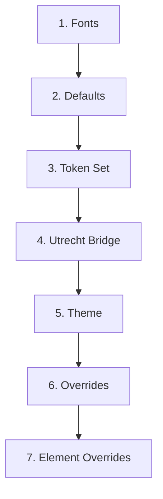

# 7-Layer CSS Architecture

NL Design uses a layered CSS architecture to translate NL Design System tokens into Nextcloud styling. Each layer serves a specific purpose and is loaded in a strict order.

## Layer Overview

## Layers in Detail

### Layer 1: Fonts (`css/fonts.css`)

Loads the **Fira Sans** font family — an open-source alternative to the proprietary RijksoverheidSansWebText. Defines `@font-face` declarations for regular, italic, bold, and bold-italic weights.

### Layer 2: Defaults (`css/defaults.css`)

Defines **all** `--nldesign-*` CSS variables with their default (Rijkshuisstijl) values. This layer ensures every variable has a value, even if the active token set doesn't define it. Incomplete token sets gracefully fall back to these defaults.

### Layer 3: Token Set (`css/tokens/{org}.css`)

The organization-specific overrides. Each token set only needs to define the variables that differ from the defaults. For example, `amsterdam.css` overrides the primary color to `#004699` but inherits the default border radius.

### Layer 4: Utrecht Bridge (`css/utrecht-bridge.css`)

Maps `--utrecht-*` component tokens to `--nldesign-component-*` variables. This temporary bridge layer exists because some NL Design System components use the Utrecht namespace. It will be removed once upstream namespaces are aligned.

### Layer 5: Theme (`css/theme.css`)

The core mapping layer. Maps `--nldesign-*` tokens to Nextcloud-specific CSS selectors and variables. This is where design tokens become actual styling — for example, `--nldesign-color-primary` is applied to Nextcloud's `--color-primary` variable.

### Layer 6: Overrides (`css/overrides.css`)

Maps Nextcloud's `--color-*` CSS variables to their `--nldesign-*` equivalents. Handles the complete set of 102 Nextcloud CSS variables, mapping 49 of them to NL Design tokens.

### Layer 7: Element Overrides (`css/element-overrides.css`)

Low-level element styling that can't be achieved through CSS variables alone. Targets specific Nextcloud HTML elements and class names (e.g., header background, button styles, link colors).

## Why Layers Matter

The order is critical:

- **Defaults before token sets** ensures incomplete themes still work
- **Token sets before theme** ensures organization-specific values are picked up
- **Theme before overrides** ensures Nextcloud variables use the correct token values
- **Element overrides last** ensures direct styling takes precedence

Changing the load order can cause visual bugs where defaults override organization-specific values or where Nextcloud variables don't pick up token changes.

## Optional Layers

Two additional CSS files are conditionally loaded based on admin settings:

- `css/hide-slogan.css` — Hides the login page tagline (when "Hide slogan" is enabled)
- `css/show-menu-labels.css` — Shows text labels in the app sidebar (when "Show menu labels" is enabled)

These are loaded after the 7 core layers.
