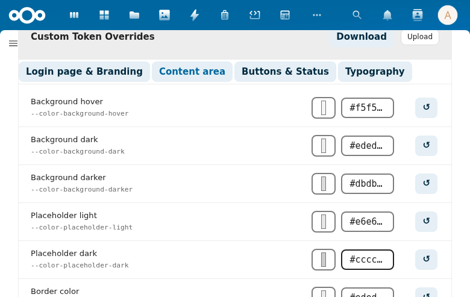
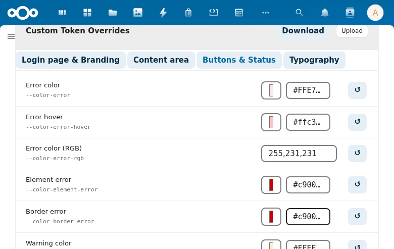
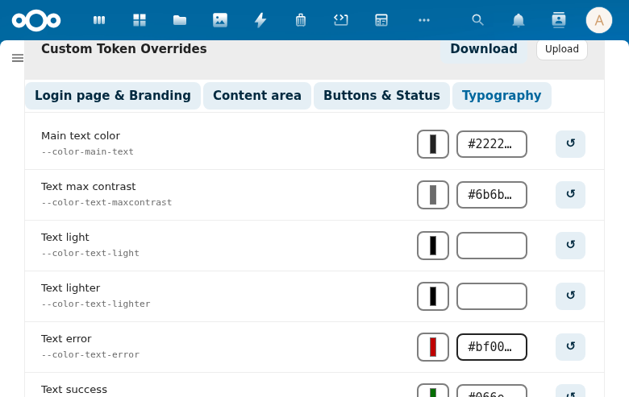
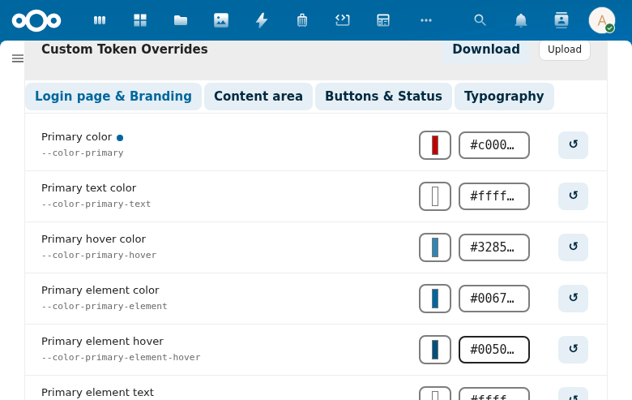
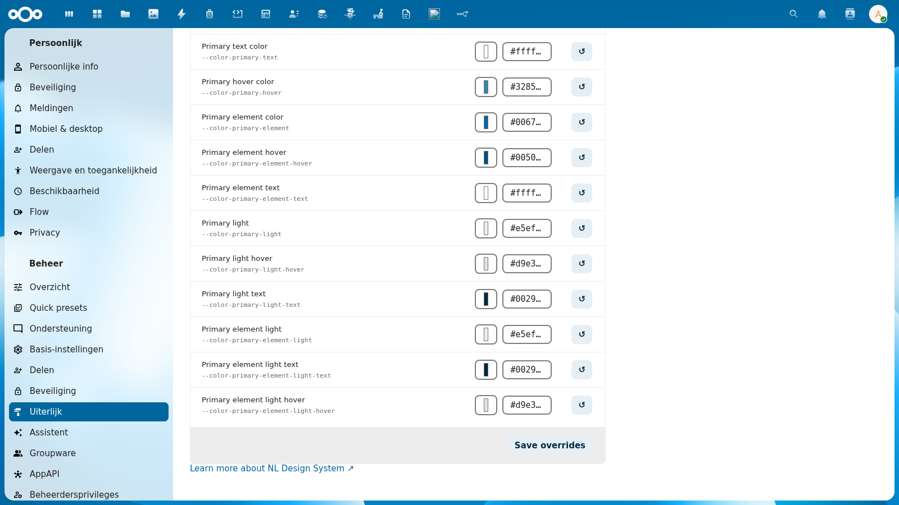

# Token Editor

The **Custom Token Overrides** section in the admin settings lets you fine-tune individual Nextcloud CSS tokens independently of your selected token set. Overrides apply as a live preview instantly, and are saved persistently when you click **Save overrides**.

## Overview

The token editor is located in the **NL Design System Theme** section of the Appearance admin settings. It consists of:

- **4 category tabs** grouping the 53 editable tokens by area
- **Per-row editing** with a color picker, hex input field, and reset button
- **Custom value badge** indicating which tokens have been manually overridden
- **Save overrides** button to persist all current values

## Category Tabs

Tokens are grouped into 4 tabs. Click a tab to switch between categories. The active tab is highlighted.

### Login Page & Branding (12 tokens)

Controls the primary brand colors used throughout the interface — buttons, links, highlights, and the login page header.

| Token | CSS Variable | Description |
|-------|-------------|-------------|
| Primary color | `--color-primary` | Main brand color for buttons and accents |
| Primary text color | `--color-primary-text` | Text on primary-colored backgrounds |
| Primary hover color | `--color-primary-hover` | Hover state for primary elements |
| Primary element color | `--color-primary-element` | Color for active/selected elements |
| Primary element hover | `--color-primary-element-hover` | Hover state for primary elements |
| Primary element text | `--color-primary-element-text` | Text on primary elements |
| Primary light | `--color-primary-light` | Light tint of primary color |
| Primary light hover | `--color-primary-light-hover` | Hover state for light primary |
| Primary light text | `--color-primary-light-text` | Text on light primary backgrounds |
| Primary element light | `--color-primary-element-light` | Light element color |
| Primary element light text | `--color-primary-element-light-text` | Text on light element backgrounds |
| Primary element light hover | `--color-primary-element-light-hover` | Hover state for light elements |

### Content Area (18 tokens)

Controls background colors, borders, and border radii — the structural appearance of the interface.

Covers: main background, dark/darker backgrounds, placeholder colors, border colors, border radius values (small, element, body container), scrollbar color.

### Buttons & Status (15 tokens)

Controls error, warning, success, and info state colors — used in alerts, status badges, validation messages, and notification banners.

Covers: error color/hover/RGB/element/border, warning color/RGB/element, success color/RGB/element/border, info color/element, and favorite star color.

### Typography (8 tokens)

Controls text colors and the font family stack.

| Token | CSS Variable | Description |
|-------|-------------|-------------|
| Main text color | `--color-text` | Primary body text color |
| Text max contrast | `--color-text-maxcontrast` | Maximum contrast text (accessible variant) |
| Text light | `--color-text-light` | Light/inverted text |
| Text lighter | `--color-text-lighter` | Lighter secondary text |
| Text error | `--color-text-error` | Error state text color |
| Text success | `--color-text-success` | Success state text color |
| Text warning | `--color-text-warning` | Warning state text color |
| Font family | `--font-face` | Full font family stack |

## Token Row Layout

Each token row contains:

- **Token name** — human-readable label (e.g., "Primary color")
- **CSS variable** — the actual CSS custom property name (e.g., `--color-primary`)
- **Color picker** — click to open a native color picker (color tokens only)
- **Hex input** — type a hex value directly (e.g., `#c00000`)
- **Reset button** (↺) — reverts the token to the value from the current token set

The color picker and hex input are always in sync — changing one updates the other instantly.

## Custom Value Badge

When a token has been manually overridden (saved to `custom-overrides.css`), a small colored dot badge appears next to the token name.

The badge color matches the overridden value, making it easy to identify which tokens have been customized at a glance.

Clicking the reset button (↺) removes the override and the badge disappears — the token returns to the token set's default value.

## Live Preview

Every change you make is applied immediately as a CSS variable override on the current page — you can see the effect instantly in the **Preview** section above the editor (shows sample primary and secondary buttons).

The live preview is not saved until you click **Save overrides**. Reloading the page without saving reverts all changes.

## Saving Overrides

Click **Save overrides** at the bottom of the token editor to persist all current values.

On save:
- Only tokens that differ from the token set's defaults are written to `custom-overrides.css`
- Tokens at their default value are excluded from the saved file
- A success toast notification confirms the save

The saved CSS file is served at every page load, so overrides persist for all users and survive browser refreshes.
