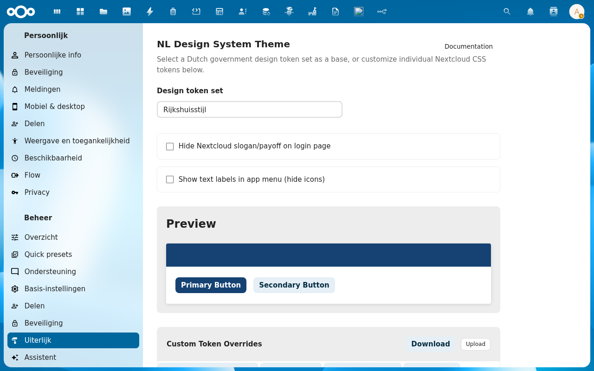
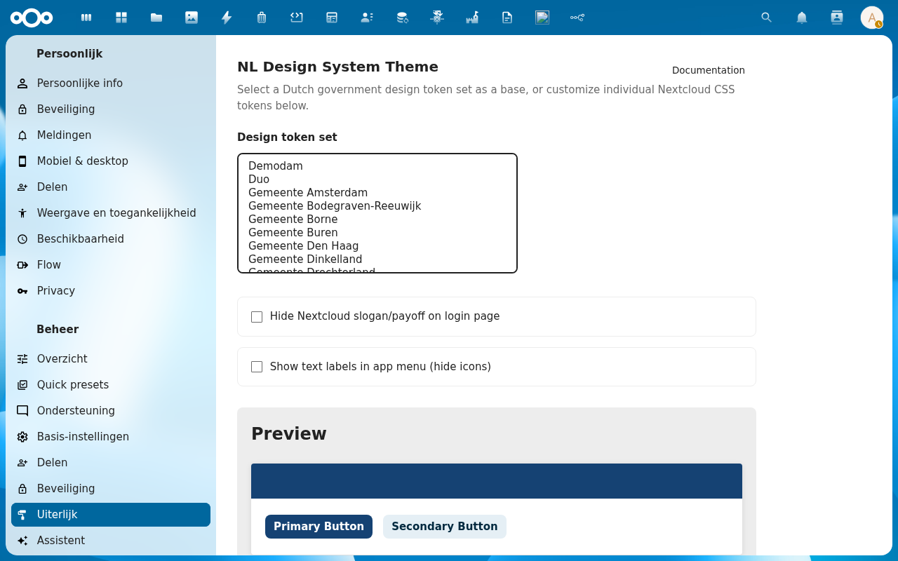
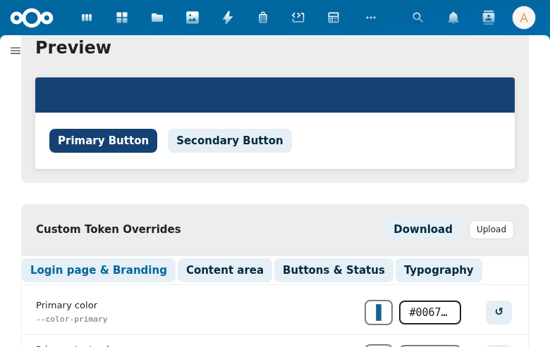
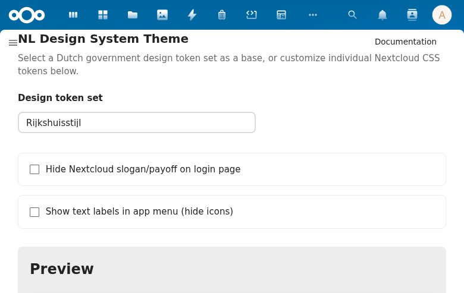

# Choosing your theme

This page walks you through picking your organisation's theme and adjusting the optional display settings.

## Where to find the settings

After installing NL Design, navigate to:

1. Click your **avatar** (top-right corner)
2. Choose **Administration settings**
3. Click **Appearance** in the left sidebar
4. Scroll down until you see the **NL Design System Theme** section

## Step 1 — Pick your organisation

Click the **Design token set** dropdown. A list of 39 organisations appears — scroll through and click yours.

As soon as you select an organisation, the **Preview** section below updates to show the new colours. The **Apply token set** dialog may appear asking which colours to apply — see [Apply Token Set Dialog](../features/apply-dialog) for details, or simply click **Apply selected** to accept all changes.

:::tip
Not sure which one to choose? Try a few — the preview updates instantly and nothing is saved until you confirm.
:::

## Step 2 — Check the preview

The **Preview** section shows sample buttons in your organisation's colours. This is a live preview of what Nextcloud will look like after you save.

## Step 3 — Optional display settings

Two checkboxes let you adjust how Nextcloud looks:

**Hide Nextcloud slogan/payoff on login page**
Removes the "a safe home for all your data" tagline from the login screen. Useful if you want a cleaner, more professional login page for your organisation.

**Show text labels in app menu (hide icons)**
Adds text labels next to the app icons in the left sidebar. This makes navigation easier for users who aren't familiar with the icons, and improves accessibility.

## That's it!

Your Nextcloud now has your organisation's house style. The change takes effect immediately for all users — no restart needed.

---

## Fine-tuning (optional)

If the theme isn't quite right — for example your organisation uses a slightly different shade of blue — you can adjust individual colours using the **Custom Token Overrides** section directly below the preview.

See [Token Editor](../features/token-editor) for a step-by-step guide on adjusting specific colours.

You can also **export your settings** as a CSS file and **import** them on another instance. See [Import & Export](../features/import-export).
