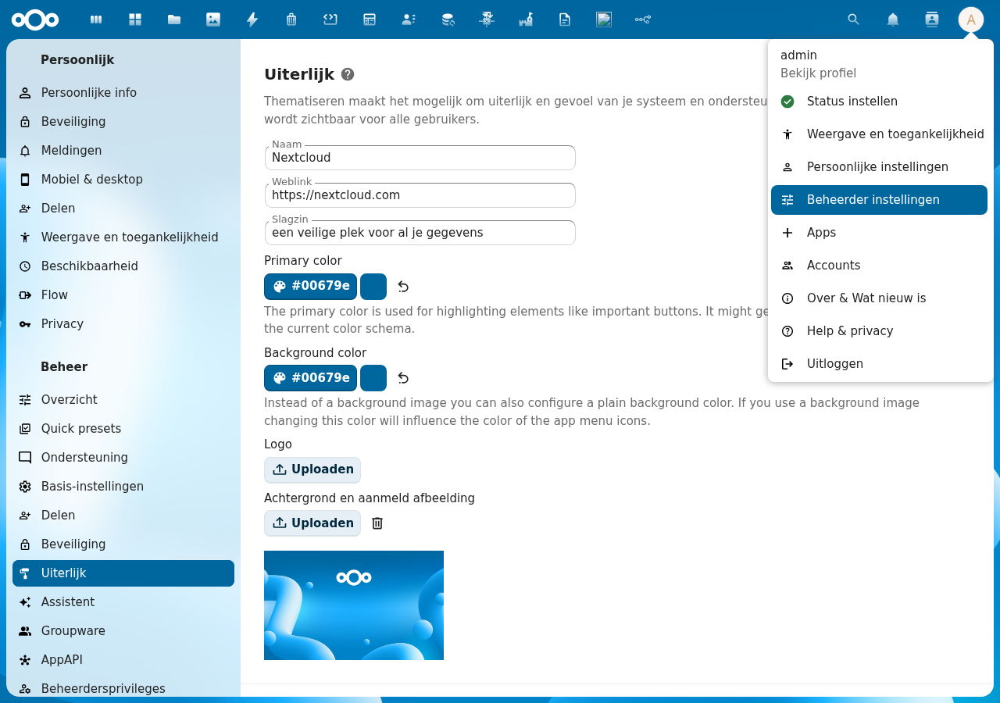
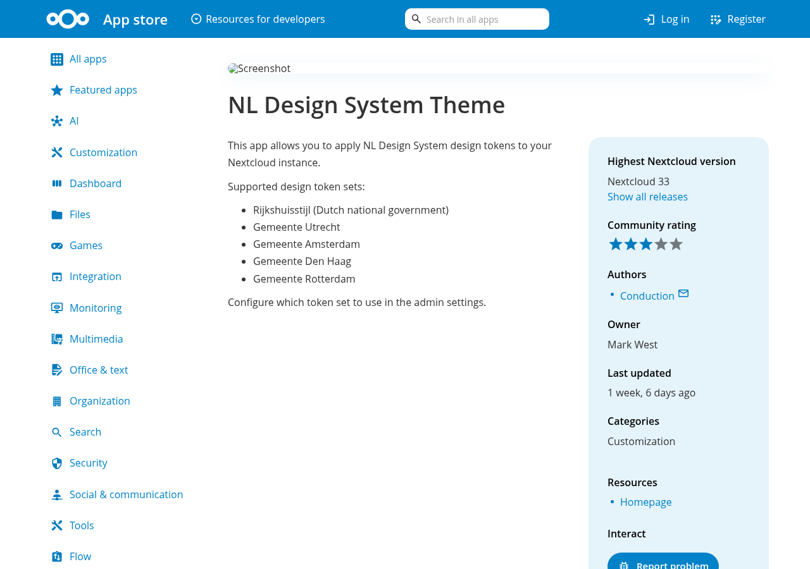

# Installing NL Design

Installing NL Design takes about one minute. You do it from inside Nextcloud — no server access needed.

## Step 1 — Open the Apps section

Log in to Nextcloud as an administrator. Click your **avatar** (top-right corner) and choose **Apps**.

## Step 2 — Search for NL Design

In the Apps section, type **NL Design** in the search bar. The app is listed under the **Customization** category.

You can also find it directly in the [Nextcloud App Store](https://apps.nextcloud.com/apps/nldesign).

## Step 3 — Click "Download and enable"

Click the **Download and enable** button next to the NL Design app. Nextcloud downloads and activates it automatically.

:::tip
Once installed, NL Design immediately applies the **Rijkshuisstijl** (Dutch national government) theme. Your Nextcloud will look different straight away — that's expected!
:::

## Step 4 — Go to the settings

After installation, you're ready to choose your organisation's theme. Go to the settings:

1. Click your **avatar** (top-right corner)
2. Choose **Administration settings**
3. Click **Appearance** in the left sidebar
4. Scroll down to the **NL Design System Theme** section

→ Continue to [Choose your theme](configuration) to pick your organisation.

---

## Requirements

- Nextcloud 28 or newer
- You need to be an administrator

## Removing the app

If you ever want to remove NL Design, go to **Apps**, find NL Design, and click **Remove**. Nextcloud will revert to its default look immediately. Your settings are saved — if you reinstall the app later, your previous theme choice will still be there.
